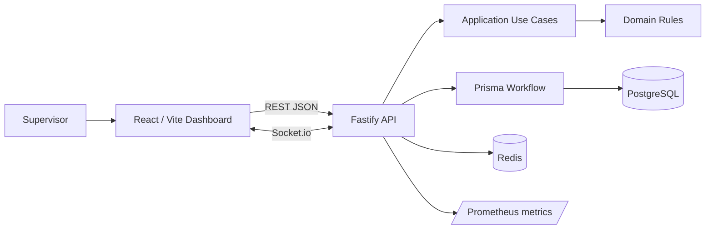

# 🚀 Nexora Pulse


Command center operacional para roteamento, fila e monitoramento em tempo real de atendimentos. O projeto implementa um desafio técnico de distribuição de atendimentos com uma experiência visual de produto SaaS fintech: distribuição automática por assunto, controle de capacidade por atendente, fila FIFO por time, auditoria, métricas e dashboard reativo via WebSocket.

## 📦 Entrega

- ✅ Roteamento por assunto para `Time Cartões`, `Time Empréstimos` e `Time Outros Assuntos`.
- ✅ Distribuição automática por menor carga, com desempate round-robin determinístico por time.
- ✅ Limite de capacidade por atendente e fila `QUEUED` quando o time está cheio.
- ✅ Pull automático do próximo item FIFO ao finalizar ou cancelar atendimento em andamento.
- ✅ Reatribuição automática quando um atendente fica offline; sem capacidade disponível, o atendimento volta para a fila.
- ✅ Auditoria operacional persistida para criação, atribuição, fila, finalização, cancelamento, reatribuição e status de atendente.
- ✅ Métricas em JSON e formato Prometheus.
- ✅ Dashboard React com KPIs, gráficos, feed de atendimentos, painel de auditoria, status dos atendentes e atualização Socket.io.
- ✅ Sidebar colapsável com persistência em `localStorage`, rotas reais e favicon oficial.
- ✅ Docker Compose com API, web, PostgreSQL e Redis.
- ✅ Testes automatizados de domínio, workflow, API e frontend.

## 🧰 Stack

- Monorepo com pnpm workspaces.
- API: Node.js 22, TypeScript, Fastify, Prisma, PostgreSQL, Redis, Socket.io, Zod, Pino e Swagger/OpenAPI.
- Web: React 18, Vite, TypeScript, Tailwind CSS, React Router, TanStack Query, React Hook Form, Zod, Recharts e Sonner.
- Testes: Vitest, Supertest e Testing Library.
- DevOps local: Docker Compose, Dockerfiles multi-stage e Prisma migrations.

## ▶️ Como executar

Subir tudo em containers:

```bash
docker compose up --build
```

Rodar localmente usando Postgres/Redis do Compose:

```bash
pnpm install
cp .env.example .env
docker compose up -d postgres redis
pnpm --filter @flowpay/api prisma:generate
pnpm db:migrate
pnpm db:seed
pnpm dev
```

Se o pnpm estiver disponível apenas via Corepack:

```bash
corepack pnpm install
corepack pnpm dev
```

URLs principais:

- 🌐 Web: `http://localhost:5173`
- 🔌 API: `http://localhost:3333`
- 📚 Swagger: `http://localhost:3333/docs`
- 💚 Health: `http://localhost:3333/health`
- ✅ Readiness: `http://localhost:3333/ready`
- 📈 Prometheus metrics: `http://localhost:3333/metrics`

## ⚡ Tour de 30s

1. Abra `http://localhost:5173`.
2. Crie um atendimento com assunto `Problemas com cartão` ou `Contratação de empréstimo`.
3. Observe o roteamento automático para o time correto e a atribuição ao atendente com menor carga.
4. Crie atendimentos até exceder a capacidade do time e veja a fila FIFO entrar em ação.
5. Finalize ou cancele um atendimento em andamento para ver o próximo item da fila ser atribuído.
6. Coloque um atendente offline e acompanhe a reatribuição ou retorno para fila.
7. Consulte o painel de auditoria e o endpoint `/metrics` para verificar os eventos e indicadores.

## 🧪 Como testar

```bash
pnpm lint
pnpm typecheck
pnpm test
pnpm build
```

Cobertura principal:

- roteamento por assunto;
- menor carga e round-robin;
- limite de capacidade;
- fila FIFO;
- pull automático ao finalizar/cancelar;
- reatribuição offline e retorno para fila sem capacidade;
- endpoints de dashboard, auditoria e métricas;
- renderização do dashboard e formulário de criação.

## 🖥️ Dashboard operacional

A primeira tela é o command center Nexora Pulse:

- sidebar colapsável com áreas de operação, qualidade, relatórios e configurações;
- header com status ao vivo, websocket, busca, refresh, tema e perfil de supervisor;
- KPIs compactos para volume, fila, capacidade e tempo médio;
- formulário de criação de atendimento com presets de assunto;
- gráficos de fila por time, carga dos atendentes e distribuição por time;
- painel de auditoria operacional com eventos recentes;
- lista de atendentes com status online/offline, capacidade e alternância de disponibilidade;
- feed de atendimentos recentes com ações de finalizar/cancelar;
- modo claro com tokens próprios, contraste revisado e componentes legíveis;
- code splitting com `React.lazy` e `Suspense` para carregar gráficos e bloco operacional sob demanda.

Rotas disponíveis:

- `/dashboard` ou `/`
- `/attendances`
- `/queues`
- `/attendants`
- `/clients`
- `/reports`
- `/quality`
- `/settings`

Validação visual recomendada:

```txt
http://localhost:5173
1366x768, 1440x900, 1920x1080 e mobile básico
```

## 🔌 API REST v1

Base REST: `/api/v1`

Swagger UI: `/docs`

Endpoints principais:

- Times: `GET /api/v1/teams`
- Atendentes: `GET /api/v1/attendants`, `POST /api/v1/attendants`, `PATCH /api/v1/attendants/:id/status`
- Atendimentos: `POST /api/v1/attendances`, `GET /api/v1/attendances`, `GET /api/v1/attendances/:id`
- Ciclo de atendimento: `PATCH /api/v1/attendances/:id/finish`, `PATCH /api/v1/attendances/:id/cancel`
- Dashboard: `GET /api/v1/dashboard/summary`, `/queues`, `/attendants-load`, `/recent-activity`
- Auditoria: `GET /api/v1/audit-events`
- Métricas: `GET /api/v1/metrics`, `GET /metrics`
- Operação: `GET /health`, `GET /ready`

Criar atendimento:

```json
{
  "customerName": "Marina Teixeira",
  "subject": "Problemas com cartão"
}
```

Criar atendente:

```json
{
  "name": "Paula Reis",
  "teamId": "team-id",
  "isOnline": true,
  "maxConcurrentAttendances": 3
}
```

Atualizar disponibilidade:

```json
{
  "isOnline": false
}
```

Filtros úteis:

```txt
GET /api/v1/attendances?status=QUEUED&teamId=team-id&page=1&pageSize=20
GET /api/v1/audit-events?type=ATTENDANCE_REASSIGNED&entityType=ATTENDANCE&page=1&pageSize=20
```

## 📡 Eventos WebSocket

Socket.io usa `VITE_SOCKET_URL` com path `/socket.io`.

Eventos emitidos:

- `attendance.created`
- `attendance.assigned`
- `attendance.queued`
- `attendance.finished`
- `attendance.cancelled`
- `attendance.reassigned`
- `queue.updated`
- `attendant.updated`
- `dashboard.updated`

O frontend invalida queries do TanStack Query ao receber eventos e recarrega dashboard, filas, atendentes, atendimentos e auditoria.

## 🧭 Superfície de decisão

| Cenário | Decisão | Evidência |
| --- | --- | --- |
| Concorrência na atribuição | Transação Prisma e `SELECT ... FOR UPDATE` no time e atendentes | `PrismaWorkflow`, testes de workflow |
| Time cheio | Atendimento fica `QUEUED` e preserva FIFO por `queuedAt`/`createdAt` | `workflow.spec.ts` |
| Atendente offline | Reatribui atendimentos ativos ou devolve para a fila sem violar capacidade | `workflow.spec.ts` |
| Observabilidade operacional | Eventos de auditoria e métricas Prometheus | `api.spec.ts`, `/api/v1/audit-events`, `/metrics` |
| Validação de entrada | Zod no shared package e JSON Schema nas rotas Fastify | `packages/shared`, `apps/api/src/http/schemas.ts` |
| Realtime no dashboard | Socket.io publica eventos de domínio e o frontend invalida queries | `use-realtime.ts` |
| Chunk inicial do web | Gráficos e coluna operacional em chunks lazy | build Vite gera `dashboard-charts` e `dashboard-operations-column` |

## 🔐 Observabilidade e segurança

- Logs via Pino/Fastify.
- Request id por requisição.
- `/health` e `/ready`.
- `/metrics` em formato Prometheus.
- Auditoria persistida em `AuditEvent`.
- Helmet, CORS por env e rate limit.
- Validação Zod e JSON Schema.
- Sanitização básica de texto.
- Prisma com queries parametrizadas.
- Error handler global sem stack trace em produção.

## 🏗️ Arquitetura

```txt
apps/api
  src/domain                 regras puras: roteamento e distribuição
  src/application            contratos e use cases
  src/infrastructure         Prisma, workflows e realtime
  src/http                   rotas, schemas, Swagger e error handler
  prisma                     schema, migrations e seed

apps/web
  src/components             dashboard, formulário, gráficos e UI
  src/pages                  páginas roteadas do command center
  src/hooks                  websocket e invalidação realtime
  src/lib                    cliente REST, query client e helpers

packages/shared
  schemas Zod, tipos DTO, constantes e eventos compartilhados
```



Clean Architecture foi aplicada de forma pragmática: rotas validam entrada e chamam use cases; regras de negócio ficam no domínio; Prisma, Redis e Socket.io ficam como adaptadores de infraestrutura.

## ⚖️ Decisões e trade-offs

- A fila foi derivada de `Attendance` para reduzir complexidade e manter FIFO claro.
- Redis ficou dedicado ao realtime via adapter do Socket.io; cache adicional não foi necessário para o core.
- Autenticação complexa ficou fora para preservar foco em roteamento, concorrência, dashboard e testes.
- Playwright ficou como melhoria futura porque o projeto não tinha dependência/browser setup instalado; adicionar isso agora aumentaria risco sobre o core.
- O dashboard invalida queries ao receber eventos em vez de manter estado duplicado manualmente.
- Round-robin usa cursor por time para desempate previsível e simples.

## 🗺️ Roadmap futuro

| Item | Motivo |
| --- | --- |
| Autenticação, RBAC e permissões granulares | Separar operadores, supervisores e administradores |
| OpenTelemetry distribuído e alertas externos | Aprofundar observabilidade além das métricas atuais |
| Playwright E2E com WebSocket real | Cobrir a jornada completa no navegador |
| Analytics histórico de SLA e abandono de fila | Transformar eventos operacionais em inteligência de gestão |
| Dashboards Grafana versionados | Entregar painéis prontos em cima do endpoint Prometheus |
